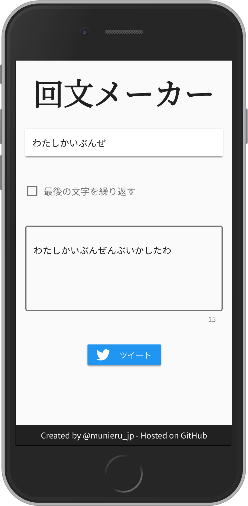

[](https://app.netlify.com/sites/kaibunmaker/deploys)

# 回文メーカー
回文を作成して共有できるサービス



## 開発
### 初期設定
#### パッケージをインストール
```sh
$ npm i
```

または

```sh
$ yarn install
```

#### 設定ファイルを作成
`config.sample.json`ファイルをコピーして`config.json`ファイルを作成します。

```sh
$ cp config.sample.json config.json
```

作成した`config.json`ファイルに以下の内容を入力してください。

|キー|説明|例|
|---|---|---|
|`BASE_DIR`|デプロイ先のベースディレクトリ|`/`|
|`GOOGLE_ANALYTICS_UA`|Google AnalyticsのトラッキングID|`UA-100023168-4`|
|`TWITTER_ID`|TwitterのID|`munieru_jp`|
|`OG_IMAGE_PATH`|OGP画像のパス|`favicon-256x256.png`|
|`ORIGIN`|デプロイ先のオリジン|`http://localhost:3000/`|

## 関連リンク
* [回文を作成して共有できるサービス「回文メーカー」をNuxt.js + Vuetify.jsで作った - Qiita](https://qiita.com/munieru_jp/items/0b9ab21af10cd41e98ba)
